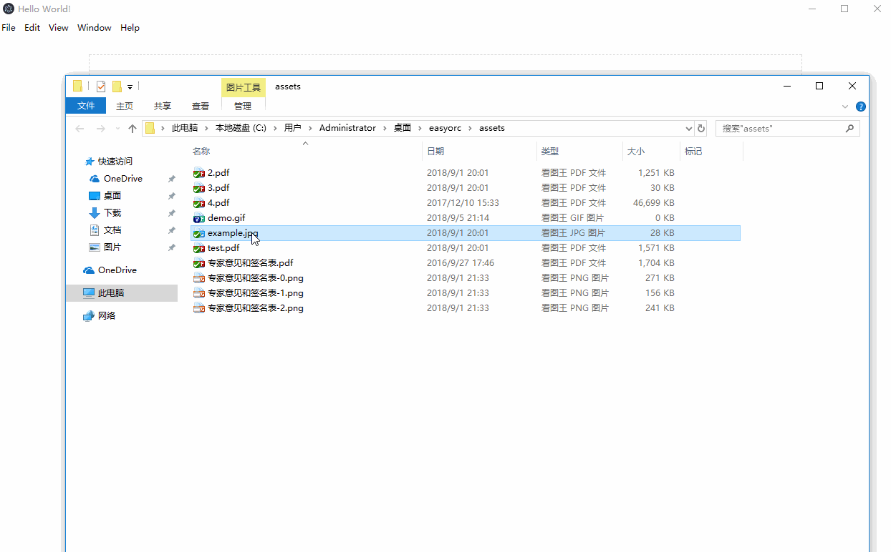

# easyocr
make ocr more easy

## Feature 

- image ocr `node test/ocr.test.js`
- converting scanned PDF's to an image
- support pdf ocr   `node test/pdf.test.js`
- support electron desktop packager

## TODO List

- support export into word

## Dependencies

### Windows

**pdf 转 图片 依赖三个软件**

软件见 `./software/` 目录下，双击安装

- GraphicsMagick  x64
- Ghostscript 9.23 for Windows x64
- pdfinfo (这个安装完成后，打开cmd输入pdfinfo回车，如果失败，就到在window环境变量path下，添加该软件安装路径即可，添加完成后，cmd执行`pdfinfo`测试是否正常)

### Ubuntu

> sudo apt-get install imagemagick ghostscript poppler-utils

### OSX (Yosemite)

> brew install imagemagick ghostscript poppler

## packager

> npm run packager

## Screenshot

## Buy me a coffee

:coffee: [Buy me a coffee](https://github.com/giscafer/buy-me-a-coffee)

## License

Apache License

---

> [giscafer.com](http://giscafer.com) &nbsp;&middot;&nbsp;
> GitHub [@giscafer](https://github.com/giscafer) &nbsp;&middot;&nbsp;
> Twitter [@nickbinglao](https://twitter.com/nickbinglao) &nbsp;&middot;&nbsp;
> Weibo [@Nickbing_Lao](https://weibo.com/laohoubin)

